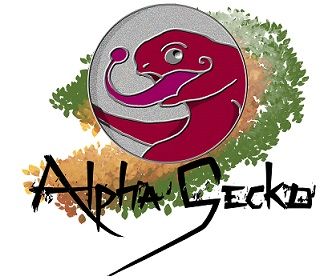

Ce script à été créé par MANSOUR Jean-Loup (AlphaGecko).

# grid_rentashop

Ce que j'appelle "bloc" correspond à une ligne contenant 3 cases. 
Les "cases" sont donc les images relatives aux partenaires et les différents textes associés. 

### Structure pour trois cases 

case1 = {  
    lien_image: "./relative_path/image.jpg",  
    lien_partenaire: "https://www.lienpartenaire.com",  
    alt: "nom_du_partenaire",   
    description_1: "Description de site de l'image 2",  
    description_2: "Description de site de l'image 3"  
}  

case2 = {  
    lien_image: "./relative_path/image.jpg",  
    lien_partenaire: "https://www.lienpartenaire.com",  
    alt: "nom_du_partenaire",   
    description_1: "Description de site de l'image 1",   
    description_2: "Description du projet de l'image 3"  
}  

case3 = {  
    lien_image: "./relative_path/image.jpg",  
    lien_partenaire: "https://www.lienpartenaire.com",  
    alt: "nom_du_partenaire",    
    description_1: "Description du projet de l'image 1",   
    description_2: "Description du projet de l'image 2"  
}  

## !! IMPORTANT !!

Créez toujours les cases trois par trois.

## NOTE 

Script entièrement prêt à l'emploi. Il ne reste plus qu'à ajouter dans votre page un container vide avec la classe "ref_container".